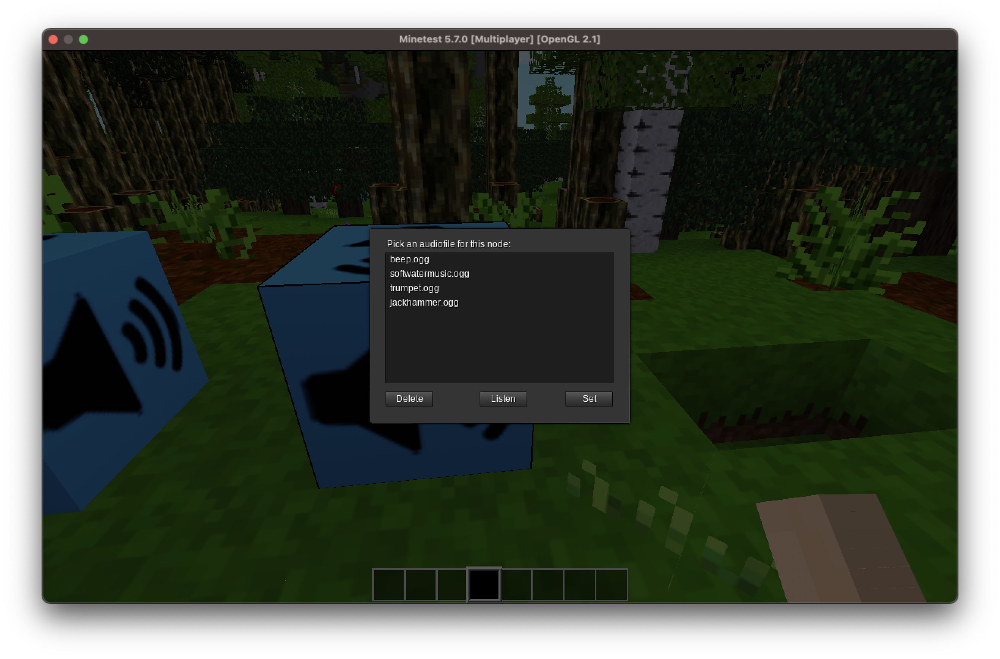

# Purpose of AudioNode Mod

Allows you to set audio blocks and set on each of them one audiofile to be played.

## Audiofiles

You can only use #.ogg" files. They must be available in the directory "sounds" within the mods directory when the server is started.

## Usage

1. Place an audionode in your world.
2. Left-Click the audionode block => the shown window pops up.
3. Select the file you want to play on this block.
4. Use the
   1. Set button to set the audio file and start playing
   2. Stop button to stop playing the file
   3. Cancel button to not change anything

